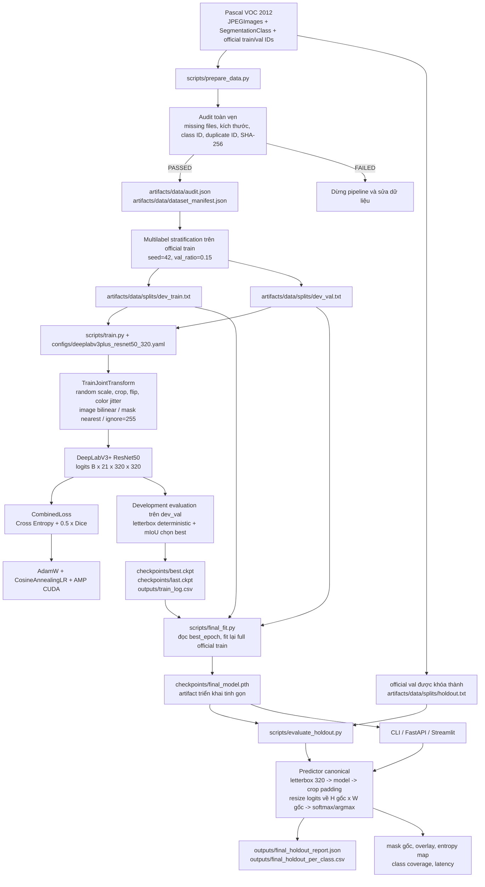

# DeepLabV3+ ResNet50 Semantic Segmentation

[](https://github.com/haminhthong/deeplabv3plus-segmentation/actions/workflows/ci.yml)
[](https://www.python.org/)
[](https://pytorch.org/)
[](https://github.com/qubvel-org/segmentation_models.pytorch)
[](https://fastapi.tiangolo.com/)
[](https://streamlit.io/)
[](https://docs.astral.sh/ruff/)
[](LICENSE)

Hệ thống phân đoạn ngữ nghĩa ảnh bằng DeepLabV3+ với encoder ResNet50, huấn luyện trên Pascal VOC 2012. Một pipeline canonical duy nhất chi phối dữ liệu, cấu hình, huấn luyện, đánh giá, báo cáo và suy luận phục vụ.

## Bài toán & Phạm vi ứng dụng (Problem & Scope)

Bài toán là gán một class ngữ nghĩa cho từng pixel của ảnh RGB. Mô hình có 21 lớp Pascal VOC: background và 20 lớp đối tượng. Kết quả là một mặt nạ class ID, mặt nạ màu Pascal VOC, ảnh overlay và các chỉ số tin cậy theo pixel.

Phạm vi của repo gồm kiểm tra dữ liệu VOC, chia tập có seed, huấn luyện DeepLabV3+ ResNet50, đánh giá mIoU/Dice/Pixel Accuracy/Boundary F1, xuất báo cáo JSON/CSV, CLI inference, FastAPI và Streamlit. Hệ thống không làm instance segmentation, object detection, open-vocabulary segmentation hoặc phân biệt các cá thể cùng lớp.

## Quy trình kỹ thuật duy nhất

Sơ đồ dưới đây là hợp đồng kỹ thuật chung. Mọi script, module, cấu hình và báo cáo phải đi qua cùng các nút dữ liệu và artifact này.



Các quy tắc không được thay đổi giữa các đường chạy:

- Ảnh và mask luôn dùng cùng ID. Mask giữ class `0..20`, biên/unknown dùng `255` và được bỏ qua trong loss/metric.
- Development train và development validation chỉ được lấy từ official train. Official val là locked holdout và chỉ dùng cho báo cáo cuối.
- Huấn luyện dùng augmentation joint; validation, holdout và serving dùng letterbox xác định. Mask resize bằng nearest-neighbor; logits mới được resize về kích thước ảnh gốc trước softmax/argmax.
- `best.ckpt` phục vụ chọn cấu hình; `last.ckpt` phục vụ resume; `final_model.pth` là artifact serving không chứa optimizer/scheduler.
- Metric chọn model là `mean_iou_all` trên `dev_val`. Báo cáo holdout có thêm mIoU foreground, Dice, Pixel Accuracy, Boundary F1 thích ứng, confusion pairs và latency.

## Luồng logic, luồng dữ liệu và báo cáo

`VOCSegmentationDataset` đọc `JPEGImages/{id}.jpg` và `SegmentationClass/{id}.png` từ split file được chỉ định. Với training, `TrainJointTransform` random scale trong `[0.75, 1.5]`, padding ngẫu nhiên nếu cần, crop về kích thước cấu hình, flip ngang và color jitter chỉ trên ảnh. Ảnh được normalize theo ImageNet; mask trở thành tensor `int64`.

Trong development evaluation, `LetterboxTransform` giữ tỷ lệ ảnh, đệm bằng `255` trên mask và đánh giá logits ở không gian `320 x 320`. Trong holdout và serving, `Predictor` dùng đúng hình học letterbox đó, cắt padding khỏi logits, nội suy logits về `(height_gốc, width_gốc)`, rồi mới tính xác suất và nhãn. Vì vậy API, UI, CLI và holdout dùng cùng một implementation.

`SegmentationMetrics` tích lũy confusion matrix theo pixel, bỏ qua target `255`, rồi tính IoU/Dice theo lớp. Boundary F1 lấy biên hình thái học và dung sai `max(1, round(diagonal * 0.005))`. `save_metrics` chuyển numpy array thành JSON hợp lệ và ghi bảng theo lớp sang CSV.

## Cấu trúc thư mục dự án

```text
.
├── .github/workflows/ci.yml
├── configs/
│   └── deeplabv3plus_resnet50_320.yaml
├── src/vocseg/
│   ├── api/app.py                  # FastAPI /health và /segment
│   ├── config.py                   # Dataclass config và YAML loader
│   ├── constants.py                # VOC classes, màu, normalization
│   ├── data/
│   │   ├── audit.py                # Audit và manifest SHA-256
│   │   ├── dataset.py              # VOCSegmentationDataset
│   │   ├── splits.py               # Split contract và stratification
│   │   └── transforms.py           # Joint augmentation và letterbox
│   ├── evaluation/
│   │   ├── development.py          # Đánh giá mỗi epoch
│   │   ├── holdout.py              # Locked holdout original-resolution
│   │   └── metrics.py              # IoU, Dice, BF1, confusion
│   ├── inference/
│   │   ├── predictor.py             # Predictor canonical
│   │   └── visualization.py         # Mask PNG và overlay
│   ├── models/deeplabv3plus.py      # Model builder và metadata validator
│   ├── schemas.py                   # Pydantic artifact/API schemas
│   └── training/
│       ├── checkpoint.py             # last, best, final artifacts
│       ├── losses.py                 # CE + Dice
│       ├── reproducibility.py        # Seed và RNG state
│       └── trainer.py                # Development training engine
├── scripts/
│   ├── prepare_data.py               # Audit + tạo split/manifest
│   ├── train.py                     # Development training
│   ├── final_fit.py                 # Fit trên full official train
│   ├── evaluate_holdout.py          # Báo cáo locked holdout
│   └── predict.py                   # CLI inference
├── demo/streamlit_app.py             # Demo ảnh upload
├── tests/
│   ├── unit/                         # Transform, split, metric, checkpoint, inference
│   ├── api/                          # Contract của FastAPI
│   └── integration/                  # Mini VOC lifecycle end-to-end
├── pyproject.toml
├── requirements.txt
├── requirements-dev.txt
└── README.md
```

Dataset, checkpoint, output và cache không nằm trong repo. Cấu trúc dataset cần có:

```text
data/VOC2012_train_val/VOC2012_train_val/
├── JPEGImages/{image_id}.jpg
├── SegmentationClass/{image_id}.png
└── ImageSets/Segmentation/
    ├── train.txt
    └── val.txt
```

## Cài đặt

Yêu cầu Python `3.10+`. Từ thư mục gốc dự án:

```bash
python -m venv .venv
# Linux/macOS
source .venv/bin/activate
# Windows PowerShell: .venv\Scripts\Activate.ps1

python -m pip install --upgrade pip
python -m pip install -e .
python -m pip install -r requirements-dev.txt
```

Đặt Pascal VOC vào đúng đường dẫn mặc định ở trên, hoặc truyền `--data-root` cho từng script. Không có dummy split và không tự tạo kết quả nếu dataset thiếu.

## Chạy pipeline

1. Audit dữ liệu và tạo split:

```bash
python scripts/prepare_data.py --data-root data/VOC2012_train_val/VOC2012_train_val
```

Kết quả gồm `artifacts/data/audit.json`, `artifacts/data/dataset_manifest.json`, `dev_train.txt`, `dev_val.txt` và `holdout.txt`.

2. Huấn luyện development:

```bash
python scripts/train.py --config configs/deeplabv3plus_resnet50_320.yaml
```

Có thể ghi đè `--epochs`, `--batch-size`, `--lr`, `--data-root`, `--output-dir`, `--checkpoint-dir` hoặc tiếp tục từ `--resume checkpoints/last.ckpt`.

3. Fit model cuối trên toàn bộ official train:

```bash
python scripts/final_fit.py \
  --best-checkpoint checkpoints/best.ckpt \
  --config configs/deeplabv3plus_resnet50_320.yaml
```

Script đọc `best_epoch` từ `best.ckpt`, ghép `dev_train` và `dev_val`, khởi tạo lại model và ghi `checkpoints/final_model.pth`.

4. Đánh giá locked holdout:

```bash
python scripts/evaluate_holdout.py \
  --checkpoint checkpoints/final_model.pth \
  --holdout-split artifacts/data/splits/holdout.txt
```

Kết quả được ghi vào `outputs/final_holdout_report.json` và `outputs/final_holdout_per_class.csv`. Chỉ chạy bước này sau khi cấu hình/model đã được khóa.

5. Suy luận một ảnh:

```bash
python scripts/predict.py \
  --image path/to/image.jpg \
  --checkpoint checkpoints/final_model.pth \
  --output-dir outputs/predictions
```

Script ghi mask màu, overlay, uncertainty map và metadata JSON.

6. Chạy API:

```bash
uvicorn vocseg.api.app:app --host 0.0.0.0 --port 8000
```

`GET /health` trả trạng thái model/device. `POST /segment` nhận multipart field `file` là JPG/PNG và trả kích thước ảnh, class xuất hiện, entropy trung bình, max probability trung bình, latency và `mask_png_base64`. Có thể đặt `CHECKPOINT_PATH` để chỉ rõ artifact.

7. Chạy Streamlit:

```bash
streamlit run demo/streamlit_app.py
```

UI chỉ nhận ảnh upload để demo; nó không duyệt locked holdout.

## Kiểm thử và CI

Chạy các kiểm tra giống GitHub Actions:

```bash
python -m ruff check .
python -m compileall -q src scripts tests demo
python -m pytest -q
```

Workflow `.github/workflows/ci.yml` dùng Ubuntu, Python 3.11, cài package ở editable mode, chạy Ruff, compileall và toàn bộ pytest. Integration test dùng VOC tổng hợp và cấu hình không tải ImageNet weights; huấn luyện thật mới dùng `encoder_weights: imagenet` trong YAML.

## Artifact và báo cáo

| Artifact | Vai trò |
| --- | --- |
| `artifacts/data/audit.json` | Kết quả kiểm tra dữ liệu và chống rò rỉ |
| `artifacts/data/dataset_manifest.json` | Checksum source/split và protocol |
| `checkpoints/last.ckpt` | Resume: model, optimizer, scheduler, scaler và RNG |
| `checkpoints/best.ckpt` | Model tốt nhất trên `dev_val` |
| `checkpoints/final_model.pth` | Model serving tinh gọn |
| `outputs/train_log.csv` | Loss và metric theo epoch |
| `outputs/final_holdout_report.json` | Metric/profiling/error analysis holdout |
| `outputs/final_holdout_per_class.csv` | Metric theo 21 lớp |

## Giới hạn hiện tại

Model chỉ nhận diện 21 lớp Pascal VOC và không có cơ chế nhận biết lớp ngoài tập. Inference được chuẩn hóa ở kích thước model `320 x 320`, sau đó khôi phục mặt nạ về kích thước gốc; ảnh rất lớn bị giới hạn ở 25 megapixel để tránh cạn bộ nhớ. `mean_max_prob` và normalized entropy là chỉ báo tin cậy từ Softmax, không phải calibration xác suất.

## License

MIT. Xem [LICENSE](LICENSE).
